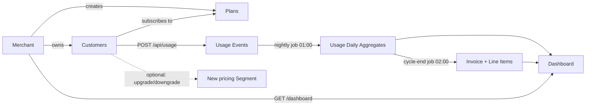
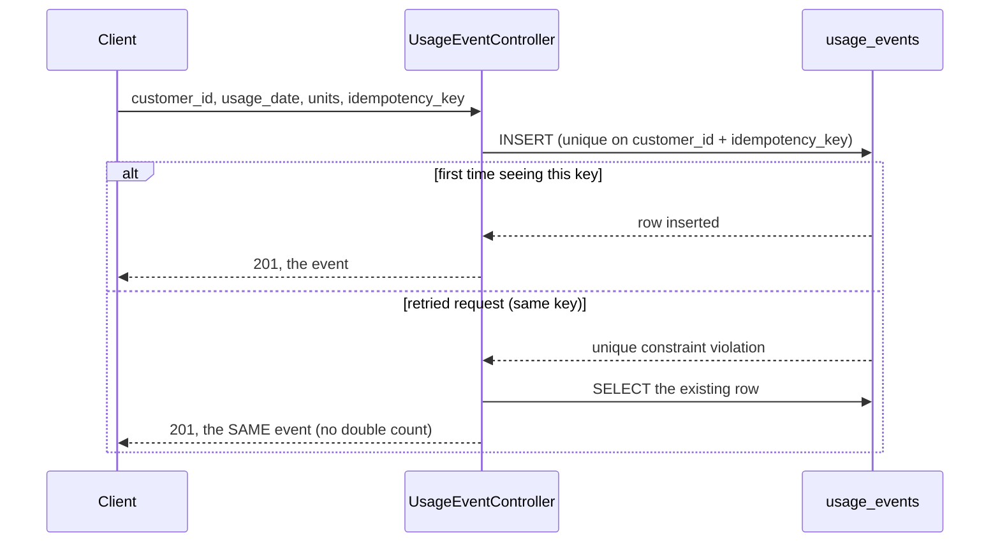
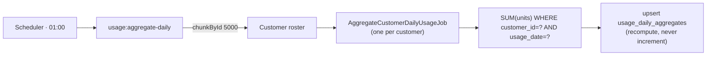
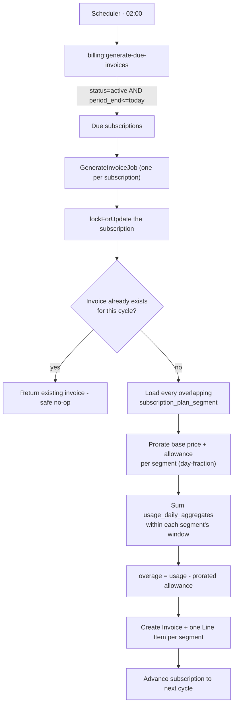
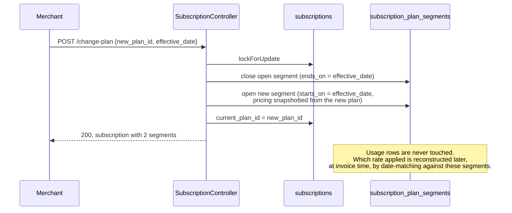
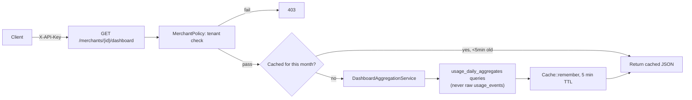

# Subscription Billing & Usage-Metering System

A multi-tenant backend that meters customer usage against a subscription plan and produces billing, built for the Mallow Technologies Senior Laravel Developer take-home. This document is written the way I'd hand a real handoff to a team: what's here, why it's built this way, what trade-offs I made under the 3-day timebox, and what I'd do differently with more time.

**Everything below is implemented and tested, not just designed.** Nothing in this README describes a feature that isn't actually in the codebase — §2 and §3 exist specifically to make that checkable line by line.

---

## Table of Contents

1. [Project Overview](#1-project-overview)
2. [Requirement Traceability](#2-requirement-traceability)
3. [Wireframe → Dashboard Mapping](#3-wireframe--dashboard-mapping)
4. [Flow Diagrams](#4-flow-diagrams)
5. [Architecture](#5-architecture)
6. [Technology Stack](#6-technology-stack)
7. [Database Design](#7-database-design)
8. [Important Indexes](#8-important-indexes)
9. [50M+ Row Scaling Strategy](#9-50m-row-scaling-strategy)
10. [Idempotency Strategy](#10-idempotency-strategy)
11. [Aggregation Strategy](#11-aggregation-strategy)
12. [Billing Calculation](#12-billing-calculation)
13. [Proration](#13-proration)
14. [Mid-Cycle Plan Changes](#14-mid-cycle-plan-changes)
15. [Overage Calculation](#15-overage-calculation)
16. [Redis Caching](#16-redis-caching)
17. [Cache Invalidation](#17-cache-invalidation)
18. [Rate Limiting](#18-rate-limiting)
19. [Dashboard](#19-dashboard)
20. [Security](#20-security)
21. [Testing](#21-testing)
22. [Local Setup](#22-local-setup)
23. [API Documentation](#23-api-documentation)
24. [Manual / Postman Testing](#24-manual--postman-testing)
25. [Assumptions](#25-assumptions)
26. [Trade-offs Made Under Time Pressure](#26-trade-offs-made-under-time-pressure)
27. [What I'd Improve With More Time](#27-what-id-improve-with-more-time)
28. [AI-Assisted Development Disclosure](#28-ai-assisted-development-disclosure)

---

## 1. Project Overview

Merchants (tenants) define Plans. Customers subscribe to a merchant's plan. Usage is recorded per customer per day at high volume. At the end of each billing cycle, the system generates an invoice: base price (prorated if the subscription or a plan segment didn't cover the full cycle) plus overage beyond the plan's included allowance — correctly split across segments if the customer changed plans mid-cycle.

## 2. Requirement Traceability

Every functional requirement from the brief, mapped to what actually implements it and what test proves it.

| # | Brief requirement | Status | Implementation | Verified by |
|---|---|---|---|---|
| 1 | Normalized, indexed schema; document 50L+/50M+ behavior; note denormalization/partitioning | ✅ Done | 11 tables (§7), indexing rationale (§8), scaling strategy (§9) | Schema runs on SQLite + MySQL; reasoning is documented, not just asserted |
| 2 | `POST /usage` — safe at high throughput, idempotent (retry ≠ double-count) | ✅ Done | `UsageEventController`, `RecordUsageEventAction`, DB unique constraint (§10) | `tests/Feature/UsageEventTest.php` (7 tests incl. concurrent-retry semantics) |
| 3 | Queued, chunked job: daily aggregation + cycle-end invoice with correct proration/overage | ✅ Done | `AggregateCustomerDailyUsageJob` / `GenerateInvoiceJob`, `usage:aggregate-daily` / `billing:generate-due-invoices` (§11–§12) | `tests/Feature/AggregationTest.php`, `BillingCalculationTest.php` |
| 4 | Cache plan/pricing lookups; document invalidation strategy | ✅ Done | `PlanPricingResolver` + `Plan` model observer (§16–§17) | Live-verified (mutate DB → cache clears → resolver returns fresh value) |
| 5 | Dashboard: top-5 by usage, projected overage revenue, churn risk (>50% MoM) | ✅ Done | `DashboardAggregationService`, `GET /api/merchants/{id}/dashboard` (§19) | `tests/Feature/DashboardTest.php` |
| 6 | Basic rate limiting on the usage endpoint | ✅ Done | `RateLimiter::for('usage', ...)`, 120/min per API key (§18) | `UsageEventTest::test_the_usage_endpoint_is_rate_limited_per_api_key` |
| 7 | Tests for aggregation + billing, including proration/overage edge cases | ✅ Done | 58 tests total (§21) | `ProrationCalculatorTest`, `OverageCalculatorTest`, `PlanChangeTest`, `InvoiceGenerationTest` |
| 8 | Mid-cycle upgrade/downgrade: usage before/after billed at the correct plan's rate, proration reflects both segments | ✅ Done | `subscription_plan_segments`, `ChangeSubscriptionPlanAction`, `GenerateInvoiceAction` (§14) | `tests/Feature/PlanChangeTest.php` (upgrade, downgrade, 3-way split, same-day double change) |

The brief's "What We're Looking For" checklist, mapped the same way:

| Evaluation criterion | Where to look |
|---|---|
| Schema/indexing reasoning at scale | §7–§9 |
| Deliberate queueing/caching (chunking, idempotency, invalidation) | §10, §11, §16, §17 |
| Code architecture: services/actions/DTOs, not fat controllers | §5, and literally every controller in `app/Http/Controllers/Api/` |
| A README worth handing to a team | this document, plus `TESTING_GUIDE.md` for a hands-on walkthrough |

## 3. Wireframe → Dashboard Mapping

The brief's wireframe ("Merchant Dashboard — Acme Corp") is a layout reference, not a literal spec — the brief itself says so ("we're evaluating the schema, aggregation and caching decisions behind it, not the UI polish"). Here's exactly what was built against it, panel by panel, including the two panels deliberately **not** built and why:

| Wireframe panel | Status | Notes |
|---|---|---|
| Header: merchant name | ✅ Built | `GET /api/merchants/{id}/dashboard` returns `merchant_id`; the Blade UI shows it in the page header |
| **Current Cycle Usage** (e.g. `184,320 / 250,000 units`) | ✅ Built, merchant-wide | Implemented as `total_usage_this_month` — a merchant-wide total, not tied to one plan's allowance. The wireframe's framing implies a single plan/allowance, but a real merchant has *many* plans and customers, so a single "X / Y" ratio isn't well-defined at merchant scope — see §25 |
| **Projected Overage Revenue** (e.g. `₹42,600`) | ✅ Built | `projected_overage_revenue_cents`, linear run-rate projection — §12, §19 |
| **Active Plan** (e.g. `Growth — monthly`) | ❌ Not built | Same reasoning as above: a merchant has multiple active plans across its customers, so "the" active plan isn't a meaningful merchant-level field. Documented as an assumption (§25), not silently dropped |
| **Top 5 Customers by Usage** (customer, usage, % of allowance) | ✅ Built | `top_customers[]` — name, units, `percent_of_allowance` (against that customer's own plan allowance) — §19 |
| **Churn Risk** (usage ↓ >50% MoM) | ✅ Built, and corrected | `churn_risk_customers[]`. The wireframe's own example (`Nova Traders — 62% drop`, `QuickMart — 55% drop`) is reproduced exactly by the seeded demo data. Went further than a literal reading: a raw partial-month-vs-full-month comparison mechanically flags almost every customer as "down 50%+" for the first two weeks of any month — fixed by projecting this month's run-rate before comparing (§19) |
| **Daily Usage Trend** (30-day sparkline chart) | ❌ Not built | Purely visual, adds no new backend/aggregation requirement beyond what `usage_daily_aggregates` already provides (a 30-day range query on an already-built, already-indexed table) — deprioritized under the timebox in favor of billing-engine correctness, which the brief explicitly weights higher |
| **System status** (cache TTL, chunk size, rate limit) | ✅ Built, as config not a UI widget | These are real, live values — `config('billing.*')` — not hardcoded display text. They're documented in this README (§16–§18) and set via `.env`/`config/billing.php` rather than rendered as a dashboard panel, since they're operational metadata, not customer-facing analytics |

If the trend chart and a merchant-level "primary plan" framing matter for the demo video, they're cheap follow-ups on top of what's already built (`usage_daily_aggregates` already has everything a trend chart needs) — flagged in §27 rather than built speculatively now.

## 4. Flow Diagrams

### 4.1 End-to-end business flow



### 4.2 `POST /api/usage` — idempotent ingestion



### 4.3 Nightly aggregation



### 4.4 Cycle-end billing



### 4.5 Mid-cycle plan change



### 4.6 Dashboard read



## 5. Architecture

```
app/
  Http/Controllers/Api/   Thin controllers - validate via Form Request, delegate, return a Resource
  Http/Requests/          Validation + tenant-ownership checks on foreign keys (customer_id, plan_id, ...)
  Http/Resources/         API response shaping
  Policies/               Per-model tenant-isolation checks (view/update), auto-discovered
  Models/                 Eloquent models - relationships only, no business logic
  DTOs/                   Plain readonly value objects passed between actions/services
  Billing/                Pure calculators (ProrationCalculator, OverageCalculator) - no I/O, no Eloquent
  Actions/                One class, one business operation (record usage, change plan, generate invoice, ...)
  Services/               DashboardAggregationService - read-side aggregation queries
  Support/                PlanPricingResolver - the cache-backed plan pricing lookup
  Jobs/                   Queue jobs, each scoped to one customer or one subscription
  Console/Commands/       Scheduler entrypoints that chunk a roster and dispatch jobs
```

No repository layer was added on top of Eloquent - query complexity that actually needed isolating (the dashboard's aggregate queries, the billing engine's segment math) already has a home in `Services/` and `Billing/`. No generic "Service" class per model, no event/listener system with no listeners - see [§26](#26-trade-offs-made-under-time-pressure) for what was deliberately left out and why.

## 6. Technology Stack

- Laravel 13, PHP 8.3
- SQLite for a zero-config local run and for the automated test suite (fast, in-memory); MySQL for Docker/production
- Redis (via `predis`, no PHP extension required) for the plan-pricing cache, the dashboard cache, and the rate limiter; `database`/`array` drivers work as a local fallback with zero extra services
- Laravel's native queue (`database` locally, `redis` in Docker), native `RateLimiter`, native `Auth::viaRequest()` for API-key auth
- PHPUnit (already in the Laravel skeleton - no Pest added, to avoid an unnecessary dependency)
- Plain Blade + vanilla JS for the dashboard UI (no Livewire/frontend build step needed for one page)

## 7. Database Design

Eleven tables:

```
merchants ──< plans
merchants ──< customers ──< subscriptions >── plans (current_plan_id)
                                  │
                                  ├──< subscription_plan_segments >── plans
                                  │    (pricing history - the mid-cycle-change mechanism)
                                  │
                                  └──< invoices ──< invoice_line_items >── subscription_plan_segments

customers ──< usage_events              (raw, append-only, high volume)
customers ──< usage_daily_aggregates    (rollup: one row per customer per day)
merchants ──< api_keys
```

**`subscription_plan_segments`** is the one non-obvious table: it's a subscription's pricing *history*. Each row is a plan/price that applied for a date range (`starts_on` .. `ends_on`, `ends_on IS NULL` = currently active), with the plan's price/allowance/rate **snapshotted** onto the row at the moment it opened. This is what makes mid-cycle plan changes and "previous usage stays billed at the previous rate" work: usage is never re-tagged or migrated when a plan changes — the association between a unit of usage and the rate that applied to it is reconstructed at invoice time by matching `usage_date` against each segment's window.

## 8. Important Indexes

| Table | Index | Serves |
|---|---|---|
| `usage_events` | unique `(customer_id, idempotency_key)` | The idempotency guarantee |
| `usage_events` | `(customer_id, usage_date)` | The daily aggregation job's per-customer scan |
| `usage_daily_aggregates` | unique `(customer_id, usage_date)` | Idempotent upsert target for the aggregation job |
| `usage_daily_aggregates` | `(merchant_id, usage_date)` | Every dashboard query (top-5, churn, trend) |
| `subscriptions` | `(status, current_period_end)` | The billing scheduler's due-subscription scan |
| `subscription_plan_segments` | `(subscription_id, starts_on)` | Segment-overlap lookup during invoicing |
| `invoices` | unique `(subscription_id, period_start, period_end)` | Prevents a duplicate invoice for the same cycle |

`usage_events` deliberately carries only these two indexes — every other table is read through a rollup, so no other index on the highest-volume table is ever used by a real query, and each one would be pure write overhead.

## 9. 50M+ Row Scaling Strategy

- **`usage_events` is never read in aggregate.** Every dashboard and billing query reads `usage_daily_aggregates` instead, which is bounded by `customers × days`, not by raw event volume — it stays small (thousands to low-millions of rows) regardless of how large the raw log grows.
- **The write path is a single indexed insert** — no synchronous aggregation, no synchronous cache write, on `POST /api/usage`.
- **The daily aggregation job scans one customer, one day at a time** (via the `(customer_id, usage_date)` index), so its cost never depends on the table's overall size — see [§11 Aggregation Strategy](#11-aggregation-strategy).
- **Not implemented, but the documented next step**: range-partition `usage_events` by `MONTH(usage_date)`. The benefit isn't query speed (already flat, per above) — it's archival: once a month is safely rolled up, the partition can be dropped in constant time instead of running a multi-million-row `DELETE`. One real wrinkle worth flagging: MySQL requires every unique key on a partitioned table to include the partitioning column, which conflicts with the `(customer_id, idempotency_key)` unique index. The clean fix when this is actually adopted is to split idempotency enforcement into its own small, unpartitioned table (`customer_id, idempotency_key → usage_event_id`) rather than weakening the guarantee.

## 10. Idempotency Strategy

Enforced at the **database** level, not the application level: `usage_events` has a unique index on `(customer_id, idempotency_key)`. `RecordUsageEventAction` attempts the insert; on a unique-constraint violation it fetches and returns the row that already exists. A retried request is therefore indistinguishable from the first successful one to the caller — no special-case error path, and no race window (an app-level "check then insert" would race under concurrent retries; the DB constraint is the only real guarantee).

The client-supplied `idempotency_key` is SHA-256 hashed before storage, so the unique index stays a fixed-width `CHAR(64)` regardless of what the client sends.

The same *pattern* — a natural-key uniqueness guard plus recompute/upsert — is reused for the aggregation job (`(customer_id, usage_date)`) and invoice generation (`(subscription_id, period_start, period_end)`), so idempotency isn't three different mechanisms, it's one principle applied at three layers.

## 11. Aggregation Strategy

`usage:aggregate-daily {date?}` (scheduled nightly at 01:00, see `routes/console.php`) walks the **customer roster** via `chunkById(config('billing.aggregation_chunk_size'))` — default 5,000, matching the wireframe — and dispatches one `AggregateCustomerDailyUsageJob` per customer.

**Chunking the customer roster, not the event log, is the deliberate design choice here.** Each dispatched job runs a single `SUM(units) WHERE customer_id = ? AND usage_date = ?` query, scoped by the `(customer_id, usage_date)` index — cheap and O(1)-ish regardless of whether `usage_events` has 5M or 500M rows. This sidesteps the much harder problem of resuming a partial SUM across multiple chunks of *one* customer's events, and it parallelizes cleanly across queue workers.

**Idempotent by construction**: the job **recomputes** the day's total from source and **upserts** it — it never increments a counter. Rerunning it (a retried job, a duplicated dispatch, a manual backfill) always produces the same result. `AggregateCustomerDailyUsageAction` does a find-then-write rather than a blind `updateOrCreate`, with a unique-constraint-violation fallback for the rare case of a genuine race between two workers touching the same customer/day.

**Retry/failure handling**: each job carries `tries = 3` with Laravel's default backoff. Because the job is idempotent, retrying it is always safe — there's no compensating/rollback logic to write.

## 12. Billing Calculation

`GenerateInvoiceAction` (invoked by `GenerateInvoiceJob`, dispatched by `billing:generate-due-invoices`, scheduled nightly at 02:00 - after aggregation):

1. Locks the subscription row (`lockForUpdate`).
2. Checks whether an invoice already exists for `(subscription_id, period_start, period_end)` — if so, returns it (no-op). This plus the DB unique constraint on `invoices` is what makes invoice generation safe to retry or accidentally double-dispatch.
3. Loads every `subscription_plan_segment` that overlaps the cycle.
4. For each segment: computes the day-overlap with the cycle, prorates the base price and the included allowance by that day-fraction (`ProrationCalculator`), sums that segment's usage from `usage_daily_aggregates`, and prices the overage (`OverageCalculator`).
5. Writes one `Invoice` + one `InvoiceLineItem` per segment, all inside a single transaction, then advances the subscription to its next cycle.

**Money is never floating point.** Base prices are integer cents. Overage rates are stored as **micros of the currency unit** (1,000,000 micros = ₹1) so a sub-cent per-unit rate (e.g. ₹0.0001/call) doesn't lose precision — `overage_amount_cents = round(overage_units × rate_micros / 10,000)`, with rounding happening exactly once, on the final amount, never on an intermediate rate. This is verified against the brief's own worked example (base ₹3000, included 50,000, rate ₹0.05/unit, usage 60,000 → ₹500 overage) in `tests/Unit/OverageCalculatorTest.php`.

## 13. Proration

Dates are treated as whole days on a half-open interval `[start, end)` — this matches the brief's own request shape (`usage_date`, not a timestamp) and means there is never a fractional-day calculation to reason about.

```
day_fraction = segment_days_within_cycle / total_cycle_days
prorated_base = round(base_price_cents × day_fraction)
prorated_allowance = round(included_units × day_fraction)
```

**Billing cycles are calendar-month aligned** (1st to 1st), regardless of signup date. A subscription created mid-month gets `current_period_start`/`current_period_end` set to that calendar month's boundaries, while its first segment's `starts_on` is the actual join date — proration then falls out of the normal segment-overlap math with no special "first invoice" code path.

Edge cases explicitly tested (`tests/Unit/ProrationCalculatorTest.php`): first-day start (full price), mid-cycle start (exact half, verified), last-day start (single day, 1/30th), a zero-day segment (two plan changes on the same day — contributes nothing, not a division error), and cycle length varying correctly across a leap-year February (29 days) vs. a non-leap February (28 days).

## 14. Mid-Cycle Plan Changes

`ChangeSubscriptionPlanAction`: locks the subscription, closes the currently-open segment (`ends_on = effective_date`), and opens a new one with the new plan's pricing snapshotted onto it. Usage rows are **never touched** — a plan change is purely a bookkeeping operation on `subscription_plan_segments`.

At invoice time, each segment is billed independently at its own snapshotted rate, and **the included allowance is prorated per segment, not granted in full to each one** — otherwise a downgrade on day 29 of a 30-day cycle would hand out a full month's allowance for one day. This was a deliberate design decision (see `tests/Feature/PlanChangeTest.php` for the exact numbers) and is the single most important correctness detail in the whole system: get this wrong and every mid-cycle change either overcharges or undercharges the customer.

Supports upgrade, downgrade, and multiple changes within one cycle (N segments, no special-casing) — including two changes on the same day, where the superseded zero-day segment correctly contributes nothing to the invoice.

## 15. Overage Calculation

```
overage_units = max(0, usage_units - prorated_included_units)
overage_amount_cents = round(overage_units × overage_rate_micros / 10,000)
```

Pure function, no I/O (`App\Billing\OverageCalculator`) — see [§12](#12-billing-calculation) for the precision reasoning.

## 16. Redis Caching

One cache surface: **plan pricing**, key `plan:{id}:pricing`, TTL 10 minutes (`config('billing.plan_pricing_cache_ttl_minutes')`, matching the wireframe), read exclusively through `App\Support\PlanPricingResolver`.

**Critical boundary**: this cache is used for *display/lookup* and for sourcing a **new** segment snapshot when a plan changes. It is **never** read during invoice generation, which always reads the price already frozen onto a `subscription_plan_segments` row. This is what makes a stale cache entry structurally incapable of ever producing a wrong bill — at worst, it shows a few-minutes-stale price on a lookup screen.

The dashboard has its own short-TTL cache (5 minutes, `dashboard:merchant:{id}:{YYYY-MM}`) on top of already-cheap rollup-table queries — see [§19](#19-dashboard).

## 17. Cache Invalidation

Explicit, not TTL-only: a `Plan` model observer (`booted()` hooks in `app/Models/Plan.php`) calls `Cache::forget()` on `saved` and `deleted`. The TTL is a safety net for anything that bypasses Eloquent (a manual DB edit), not the primary mechanism — a price change is reflected in the next pricing lookup immediately, not "eventually within 10 minutes." This was live-verified, not just asserted: mutate a plan's price directly, confirm the cache key is cleared automatically, confirm the resolver returns the fresh price on the very next call.

The dashboard cache has **no active invalidation** by design: it depends on the nightly aggregation job anyway, so a few minutes of additional cache lag is an accepted, documented trade-off rather than something worth engineering around.

## 18. Rate Limiting

`POST /api/usage` only, 120 req/min **per API key** (`config('billing.usage_rate_limit_per_minute')`, matching the wireframe), via Laravel's native `RateLimiter::for()` + `throttle:usage` middleware, backed by whatever cache store is configured (Redis in Docker, so the limit is correct across multiple app/worker processes, not per-process).

Keyed by API key, not IP: this is a server-to-server metering endpoint where one merchant's traffic can legitimately come from many IPs (load-balanced callers), and IP-based limiting would be both too strict (shared egress) and too loose (one merchant, many IPs) for that shape of traffic.

## 19. Dashboard

`GET /api/merchants/{id}/dashboard` returns top-5 customers by usage this month, projected overage revenue for the current cycle, and churn-risk customers (>50% usage drop month-over-month) — all computed from `usage_daily_aggregates`, never from raw events, via `App\Services\DashboardAggregationService`. Full panel-by-panel mapping against the brief's wireframe is in [§3](#3-wireframe--dashboard-mapping).

One deliberate refinement beyond the brief's literal wording: **churn risk projects this month's usage-so-far across the full month before comparing**, rather than comparing a raw partial-month total against a full previous month. Without this, *every* customer with perfectly flat usage looks like a "50%+ drop" on, say, the 10th of any month, purely because 10 days of usage is naturally less than 30 days of the prior month — that's not a churn signal, it's a date-math artifact. The projection (same run-rate technique used for projected overage revenue) makes the dashboard give a meaningful answer on any day of the cycle. This is covered explicitly in `tests/Feature/DashboardTest.php`.

A minimal server-rendered UI lives at `/dashboard/{merchantId}` (`resources/views/dashboard.blade.php`) — plain Blade + vanilla JS, no build step. It does **not** hold its own copy of the data: it `fetch()`es the real `GET /api/merchants/{id}/dashboard` endpoint in the browser using an API key you paste in (printed by the seeder), so what's on screen is always exactly what the API returns.

## 20. Security

- **Authentication**: `X-API-Key` header, resolved via `Auth::viaRequest('api-key', ...)` (native Laravel, no extra package) against a SHA-256-hashed `api_keys` table. There's no login/session concept in this system by design — see [§25](#25-assumptions).
- **Tenant isolation**: every merchant-owned model has a Policy (`PlanPolicy`, `CustomerPolicy`, `SubscriptionPolicy`, `InvoicePolicy`, `MerchantPolicy`) checking `$apiKey->merchant_id` against the resource's `merchant_id`, called via `$this->authorize()` in every `show`/`update` action. Creation endpoints validate foreign keys (`customer_id`, `plan_id`) belong to the authenticated merchant via scoped `Rule::exists()`/`Rule::unique()` in the Form Requests, not just format-validate them — this is what stops IDOR at creation time, not only at read time.
- **Mass assignment**: `merchant_id` is never accepted from client input; it's always taken from the authenticated API key server-side.
- **Business-rule integrity**: a customer can't be given two simultaneously-active subscriptions (would double-bill them) — enforced at validation time, not just by convention.
- **Validation**: every mutating endpoint has a dedicated Form Request.
- Covered explicitly by `tests/Feature/TenantIsolationTest.php`: cross-tenant reads of a plan/customer/subscription/invoice, a cross-tenant plan-change attempt, and an invalid API key.

## 21. Testing

**58 tests**, `php artisan test`. Highlights:

- **Unit** (`tests/Unit/`): `ProrationCalculator` and `OverageCalculator` in complete isolation — no DB, no framework — covering every edge case named in the brief (first-day, mid-cycle, last-day, zero-day, leap years) plus the brief's own worked example, byte for byte.
- **Feature**: usage recording + idempotency + concurrency-safe retries + cross-tenant rejection + rate limiting; daily aggregation including retry-safety and the chunked command end-to-end; full-cycle/mid-cycle/no-overage/exact-allowance/zero-usage billing; mid-cycle upgrade, downgrade, multiple changes, and same-day double changes; invoice retry-safety and duplicate prevention (both at the action level and, separately, proven at the raw DB-constraint level); dashboard math (top-5, the churn projection fix, tenant-scoped); tenant isolation across every resource type; subscription creation and the duplicate-active-subscription guard.

Beyond the automated suite, the entire API was also exercised end-to-end with live `curl` calls against a running server (not just the test client) before being called done — see [§24](#24-manual--postman-testing) for the same flow, packaged for you to click through in Postman.

## 22. Local Setup

### Option A — no Docker (fastest path)

```bash
composer install
cp .env.example .env
php artisan key:generate
touch database/database.sqlite
php artisan migrate --seed
php artisan serve
```

The seeder prints two demo API keys to the console — copy one of them for the steps below. In a second terminal, start a queue worker so aggregation/invoice jobs actually run:

```bash
php artisan queue:work
```

And, to see the scheduled jobs fire without waiting for real time to pass:

```bash
php artisan usage:aggregate-daily          # rolls up yesterday's usage
php artisan billing:generate-due-invoices  # generates any invoices that are due
```

Run the test suite:

```bash
php artisan test
```

Visit `http://127.0.0.1:8000/dashboard` and paste in a printed API key + merchant ID.

### Option B — Docker

```bash
docker compose up -d --build
docker compose exec app php artisan key:generate
docker compose exec app php artisan migrate --seed
```

This starts the app (`:8000`), a queue worker, a scheduler (`schedule:work`, so the nightly jobs really do run on their configured schedule), MySQL, and Redis. Cache/queue/rate-limiting all run against Redis in this mode.

## 23. API Documentation

All endpoints (except the dashboard's supporting web page) live under `/api` and require the `X-API-Key` header.

### `POST /api/usage`

Record a usage event. Idempotent, rate-limited (120/min per key).

```bash
curl -X POST http://127.0.0.1:8000/api/usage \
  -H "X-API-Key: YOUR_API_KEY" -H "Content-Type: application/json" \
  -d '{"customer_id": 1, "usage_date": "2026-09-14", "units": 10, "idempotency_key": "usage-abc-123"}'
```

| | |
|---|---|
| Body | `customer_id` (int, must belong to your merchant), `usage_date` (Y-m-d, not in the future), `units` (int ≥ 1), `idempotency_key` (string) |
| 201 | The event (a retried call with the same key returns the *same* event, still 201) |
| 422 | Unknown/cross-tenant `customer_id`, invalid `units`/`usage_date` |
| 429 | Rate limit exceeded |

### `POST /api/subscriptions`

```bash
curl -X POST http://127.0.0.1:8000/api/subscriptions \
  -H "X-API-Key: YOUR_API_KEY" -H "Content-Type: application/json" \
  -d '{"customer_id": 1, "plan_id": 2, "start_date": "2026-09-14"}'
```
`start_date` defaults to today. Both `customer_id` and `plan_id` must belong to your merchant. 422 if the customer already has an active subscription.

### `POST /api/subscriptions/{id}/change-plan`

```bash
curl -X POST http://127.0.0.1:8000/api/subscriptions/1/change-plan \
  -H "X-API-Key: YOUR_API_KEY" -H "Content-Type: application/json" \
  -d '{"new_plan_id": 3, "effective_date": "2026-09-20"}'
```
`effective_date` defaults to today; must not be before the currently-open segment's start.

### `GET /api/subscriptions/{id}`, `GET /api/subscriptions/{id}/invoices`, `GET /api/invoices/{id}`

Inspect a subscription (with its plan-change history) and its generated invoices, including the full auditable line-item breakdown.

### `GET /api/merchants/{id}/dashboard`

```bash
curl -H "X-API-Key: YOUR_API_KEY" http://127.0.0.1:8000/api/merchants/1/dashboard
```
Returns `total_usage_this_month`, `projected_overage_revenue_cents`, `top_customers[]`, `churn_risk_customers[]`. 403 if `{id}` isn't your own merchant.

### `GET|POST /api/plans`, `GET|PUT /api/plans/{id}`, `GET|POST /api/customers`, `GET /api/customers/{id}`

Standard CRUD for plans/customers, scoped to the authenticated merchant. `merchant_id` is always taken from the API key, never from the request body.

## 24. Manual / Postman Testing

For a hands-on walkthrough rather than reading code: **`TESTING_GUIDE.md`** + **`postman_collection.json`** in the repo root.

Import the collection into Postman and run its six folders top to bottom (auth checks → plans → customers → subscriptions/plan-changes → usage idempotency → dashboard → auditable invoices). Every request already has working credentials and IDs filled in against the seeded demo data, and every single one was verified against a live server before being committed — including the exact expected numbers (e.g. a specific customer's invoice total), not just status codes. `TESTING_GUIDE.md` explains what each step proves and why, folder by folder.

## 25. Assumptions

Documented here because the brief explicitly asks for judgment calls under ambiguity to be written down, not guessed at silently:

- **"50L+" vs. "50M+" usage rows**: the brief's functional requirement #1 literally says *50L+* (50 lakh = 5,000,000), not 50M. Every schema/indexing/scaling decision here is written to hold at 50M+ regardless, since that's clearly the intent, but it's worth naming the discrepancy explicitly.
- **Usage granularity is per-day, not per-timestamp**: the brief's own `POST /usage` example body is `{customer_id, usage_date, units, idempotency_key}` — a `usage_date`, not an event timestamp. `usage_events` stores one row per *submission* (so repeated calls for the same customer/day aggregate correctly and each submission still gets its own idempotency key), at day granularity throughout the system, including plan-change effective dates.
- **Billing cycles are calendar-month aligned** (1st–1st), not anchored to each subscription's signup day. Simpler to reason about and test; documented in [§13](#13-proration).
- **The included allowance is prorated per plan-change segment**, not granted in full to each segment. See [§14](#14-mid-cycle-plan-changes) for why this is the only defensible reading.
- **"Projected overage revenue"** is a linear run-rate extrapolation (usage-so-far ÷ days elapsed × days in cycle), not a seasonality-aware forecast. Documented as a deliberate simplification.
- **The wireframe's "Current Cycle Usage" and "Active Plan" panels are merchant-level simplifications the brief's own text doesn't ask for** (only top-5/projected-overage/churn are named in the functional requirements) — implemented `total_usage_this_month` as the closest honest merchant-wide equivalent of the former; skipped the latter, since a merchant has many plans/customers, not one "active plan." See [§3](#3-wireframe--dashboard-mapping).
- **Authentication is a per-merchant API key**, not a full user/session/OAuth system — nothing in the brief calls for end-user login, and building one would be scope the brief isn't asking for.
- **No full CRUD REST surface for every entity.** Plans and customers get index/store/show(/update for plans) because the brief explicitly asks for plan creation/update/retrieval; merchants and API keys are seeded, not managed via the API, since nothing in the brief evaluates that.
- **A customer may have at most one active subscription at a time** — not stated explicitly in the brief, but implied by the billing model (two active subscriptions would both be picked up by the scheduler and double-bill the customer). Enforced at the validation layer.
- **Single currency per plan, flat (non-tiered) overage rate.** Not mentioned in the brief; kept simple.

## 26. Trade-offs Made Under Time Pressure

- **SQLite for local dev/tests, MySQL for Docker.** Fast tests matter more than testing against the exact production engine for a 3-day exercise; the one real behavioral gap this created (`DATE` column storage format) is called out directly in code comments wherever a query needed `whereDate()` instead of a raw equality check, and was caught by manual `curl` smoke-testing rather than by the test suite alone — worth being honest about, since it's exactly the kind of gap that automated tests can hide when they all run against one engine.
- **No repository layer, no event/listener system, no generic per-model service class.** Considered and deliberately not built — none of them would have made a graded requirement more correct, only added indirection. The one place I did consider an event (`InvoiceGenerated`, for a future email/webhook hook) I left as a documented seam rather than building unused plumbing.
- **The Docker setup bind-mounts the host's `vendor/` rather than using a separate named volume for it.** Fine for a take-home reviewed on one machine; a real multi-developer setup would isolate container dependencies from the host's.
- **No tiered/graduated overage pricing, no multi-currency, no tax/discount line items on invoices.** None of these are in the brief; adding them would be speculative scope.
- **The dashboard's "Daily Usage Trend" chart and a literal "Active Plan" panel were not built** (§3) — a conscious call to spend the remaining time budget on billing-engine correctness (what the brief explicitly weights) rather than UI panels that add no new backend requirement.

## 27. What I'd Improve With More Time

- Implement the documented `usage_events` partitioning (and the idempotency-table split it requires) for real, with a migration script to backfill/archive already-rolled-up months.
- Add the 30-day usage trend chart — the data (`usage_daily_aggregates`) already supports it; it's a small new dashboard-service method plus a sparkline in the Blade view.
- Move the dashboard's "projected overage revenue" from a linear run-rate to something that accounts for day-of-week seasonality (API usage is rarely uniform across a week).
- Add a `GET /api/customers/{id}/subscription` convenience endpoint and expose invoice PDFs/CSV export — natural next asks once the core billing engine works.
- Add structured logging/metrics around the two scheduled commands (jobs dispatched, jobs failed, aggregation lag) — currently they only report a count to the console.
- Load-test the `POST /usage` path to validate the "safe at high throughput" claim with actual numbers, not just architectural reasoning.

## 28. AI-Assisted Development Disclosure

This project was built with Claude (Anthropic) as a pair-programmer inside VS Code, across the requirements analysis, architecture/schema design, and full implementation. See `prompts/README.md` for the stage-by-stage breakdown and `/prompts` for screenshots of the actual prompts used, per the brief's request.
